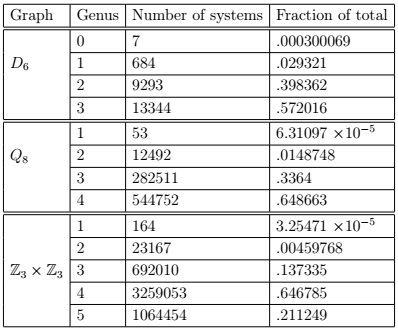

# orientable-embeddings



## A C++ program to compute orientable embeddings of Cayley graphs

This program implements an algorithm to compute the [surface embeddings](https://en.wikipedia.org/wiki/Graph_embedding) of a given [Cayley graph](https://en.wikipedia.org/wiki/Cayley_graph).

To reduce computation, only embeddings in orientable surfaces are considered. The program counts the number of embeddings of the graph in each orientable surface of genus *K*.


## How to build

To rebuild "main.exe", you need to compile "main.cpp". 

For example: if you're using [mingw-w64](http://mingw-w64.org/doku.php) on Windows, with the g++ compiler, run:

```g++ -g main.cpp -o main.exe```

## How to use

Run ```main.exe```. The program computes the number of orientable embeddings of *Q_8*, the quaternion group.

To compute a different group, change the GRAPHCHOICE variable in ```main.cpp```. The following groups are implemented:

| GRAPHCHOICE | Group |
|-------------|-------|
| 1           | *Z_2 x Z_2* (direct product of cyclic groups) |
| 2           | *Z_2 x Z_3* (direct product of cyclic groups) |
| 3           | *D_6* (dihedral group)                        |
| 4           | *Q_8* (quaternion group)                      |
| 5           | *Z_3 x Z_3* (direct product of cyclic groups) |
| 6           | *A_4* (alternating group)                     |

*Note:* for each group, the Cayley graph is based on a typical presentation using 2 generating elements. This graph is hard-coded for each GRAPHCHOICE.

To add a new graph for a 2-generator group presentation, you will need to:

1. Add the multiplication table for the group presentation, using the format described in comments at the start of ```main()```
2. Add the order of the group in the ```switch``` statement that sets ```tempOrder```

*Note:* running the program for *A_4* (order 12) took over 24 hours on my laptop, so the computation time increases very fast with the order of the group.
